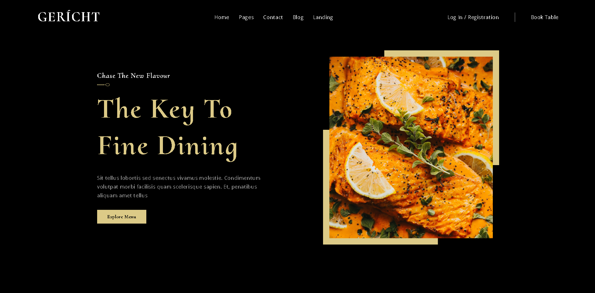

# Restaurant Web Application



## Goal

To provide a modern, fully responsive restaurant web interface built with React, styled components, and dynamic interactive sections, delivered via a containerized environment. 

---

## Architecture & Tech Stack

The application is structured as a client-side React single-page application (SPA) created with Create React App and TypeScript: 
- **Frontend Framework:** React with TypeScript for UI component structure and type safety. 
- **Styling:** Styled CSS components for dynamic, scoped styling. 
- **Containerization:** Docker & Docker Compose setup (`Dockerfile`, `docker-compose.yml`) for serving the web application locally on port `3000`. 

### Project Stack Breakdown

- **Frontend:** React, TypeScript 
- **Styling:** CSS / Styled Components 
- **DevOps:** Docker, Docker Compose 

---

## Key Features & Functionality

- **Responsive Restaurant UI:** Clean, modern layout tailored for restaurant presentation across desktop and mobile screens. 
- **Interactive Sections:** Dynamic UI elements for browsing menu options, features, or promotional sections. 
- **Containerized Environment:** Fully dockerized deployment pipeline enabling standardized execution across developer setups. 

---

## How to Run

### Requirements

- Docker and Docker Compose (or Docker Desktop) 

### Running via Docker

1. **Clone the Repository:**
   ```bash
   git clone https://github.com/iammaou/restaurant-web-ui.git
   cd restaurant-web-app
   ``` 

2. **Start Containerized Service:**
   ```bash
   docker compose up -d
   ``` 

3. **Access the Application:**
   Open a browser and navigate to `http://localhost:3000`. 
